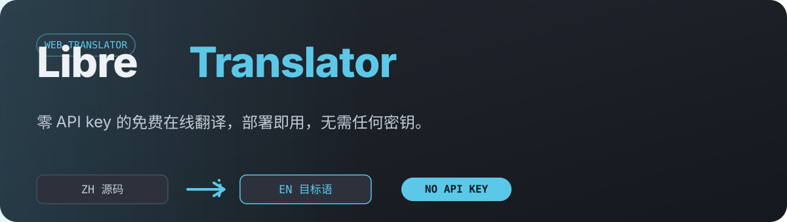

# LibreTranslator

<p align="center">
  
</p>

**零 API key 的免费在线翻译**。部署到 Cloudflare Pages 即可使用，前端零成本调用 Google 免费翻译端点，无需注册、无需任何密钥。

## 功能

- **40+ 语言互译**，自动检测源语言
- **实时翻译**：输入防抖 700ms 自动翻译，或 Ctrl+Enter 手动翻译
- **语音朗读**、**一键复制**、**翻译历史**（localStorage 保留最近 50 条）
- **明暗主题**自适应系统
- **可选访问密码**：页面级 + 接口级双重防护
- **多语言 UI**：中文 / English / Deutsch

## 工作原理

```
浏览器 (你的站点 /)
   │  只请求本站 /api/translate，永不接触 API key
   ▼
CF Pages Function (functions/api/translate.js)
   │  服务端转发到 Google 免费端点（解决浏览器跨域）
   ▼
Google Translate (translate.googleapis.com/translate_a/single?client=gtx)
```

- **无需 API key**：Google gtx 是公开免费端点，不暴露任何密钥
- **接口不暴露**：前端只调用同域 `/api/translate`，上游细节对浏览器完全隐藏
- **可自定义端点**：如需切换自建 DeepLX 或其他兼容服务，配置 `DEEPLX_API_URL` 即可

> 为什么不用 api.deeplx.org？该公共端点部署在 Cloudflare 后面，会拦截来自其他 Cloudflare 数据中心（Pages Functions）的出站请求（403 挑战页）。Google 基础设施不拦截 CF 出站，且零 key、响应为标准 JSON。

## 快速开始

### 1. 部署到 Cloudflare Pages

1. Fork / 推送本仓库到 GitHub
2. 登录 [Cloudflare](https://www.cloudflare.com/) → **Workers & Pages** → **Create** → **Pages** → **Connect to Git**，选择本仓库
3. 构建设置：
   - **Framework preset**: Create React App
   - **Build command**: `npm run build`
   - **Build directory**: `build`

   > 注：`npm run build` 已在 package.json 中配置 `NODE_OPTIONS=--openssl-legacy-provider`，适配旧版依赖链在现代 Node 下构建；如遇 Node 版本问题可安装 Node 16/18 后重试。
4. **Save and Deploy** —— `functions/` 目录会被自动识别为 Pages Functions

> 无需配置任何环境变量即可使用默认的 Google 免费翻译。

### 2. 本地开发

```bash
npm install
npm start
```

翻译请求同样走 `/api/translate` 代理。本地开发可运行 `wrangler pages dev`，默认 Google 免费翻译、无需配置。

## 环境变量（可选）

> ⚠️ **绝不要用 `REACT_APP_` 前缀存放 API key 或密码**——`REACT_APP_` 前缀的变量会被 CRA 内联进前端 JS bundle，任何访客都能在浏览器源码里看到。必须使用下面的非 `REACT_APP_` 名称，它们只存在于服务端。

| 变量名 | 必填 | 说明 |
| --- | --- | --- |
| `DEEPLX_API_URL` | ❌ | 默认使用 Google 免费翻译端点，无需配置。切换自建 DeepLX 时填写其地址（含或不含 `/translate` 均可，函数自动补全） |
| `DEEPLX_API_TOKEN` | ❌ | 自定义端点需要 token 鉴权时填写（Google gtx 不需要） |
| `DEEPLX_ACCESS_PASSWORD` | ❌ | 防滥用访问密码。配置后前端必须携带正确密码才能调用翻译接口（推荐开启） |
| `REACT_APP_PASSWORD` | ❌ | 页面访问密码（可选，页面级门禁；会被内联进前端，仅作弱保护） |

**推荐配置**：`DEEPLX_API_URL` 留空（用默认 Google 端点），同时配置 `DEEPLX_ACCESS_PASSWORD` 与 `REACT_APP_PASSWORD` 为同一个强密码。这样访问者需先通过页面密码门禁，即使 `/api/translate` 被发现，没有密码也无法刷接口。

## 语言代码

前端语言代码（`ZH` / `ZH-HANS` / `ZH-HANT` / `EN-GB` …）与 Google 代码（`zh-CN` / `zh-TW` / `en-GB` …）在代理内自动映射，检测到的源语言会回显到输入框头部。

## 许可证

本仓库尚未声明许可证。如需使用、修改或分发，请先联系作者确认授权。